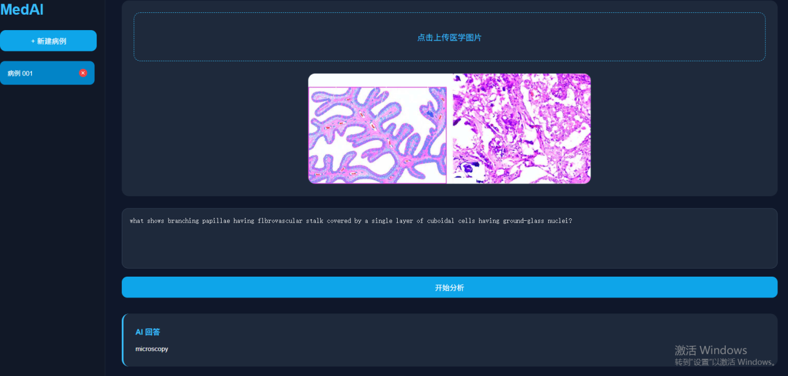

# 🔬 PathVQA-DualTrack

Official PyTorch implementation for the paper: **"A Parameter-Efficient Fine-Tuning and Dual-Track Decoding Framework for Pathology Visual Question Answering"**.

[](https://opensource.org/licenses/Apache-2.0)
[](https://www.python.org/)
[](https://pytorch.org/)

## 📖 Introduction
Medical Visual Question Answering (Med-VQA) in pathology faces unique challenges, including ultra-high resolutions and severe hallucination issues in closed-ended tasks. This repository implements a framework built upon **MedGemma-1.5-4B**, featuring:
- 🚀 **QLoRA with Loss-on-Answer-Only:** Efficient tuning while freezing the vision encoder.
- 🛤️ **Dual-Track Decoding Engine:** A specialized log-prob scoring mechanism for closed-ended questions and optimized autoregressive generation for open-ended questions.
- 📊 **Multi-dimensional Semantic Evaluation:** Comprehensive metrics (WBSS, CBSS, Exact/Relaxed Match) for rigorous pathology VQA benchmarking.

## 🖥️ Interactive Web UI
We provide a user-friendly web interface for real-time inference and analysis. The UI allows users to upload pathology slides, input clinical questions, and directly observe the dual-track decoding results.



## 📥 Model Weights
The base model used in this project is **MedGemma-1.5-4B-IT**. 

- **Hugging Face Hub:** [google/medgemma-1.5-4b-it](https://huggingface.co/google/medgemma-1.5-4b-it)
- **Official Repository:** [Google-Health/medgemma](https://github.com/Google-Health/medgemma)

> **Note:** Please ensure you have accepted the *Health AI Developer Foundations License* on the Hugging Face model page to access the weights.

## 📂 Repository Structure
```text
PathVQA-DualTrack/
├── README.md               
└── src/                    # Core source code
    ├── train_qlora.py      # QLoRA instruction tuning
    ├── metrics.py          # WBSS, CBSS, and accuracy metrics
    ├── run_baselines.py    # Inference scripts for baselines
    └── evaluate.py         # Evaluation and scoring pipeline
```
## 🚀 Quick Start & Reproduction

To facilitate full reproducibility of the experimental results reported in the paper, please follow the step-by-step instructions below.

# Step 1: Environment Setup
Clone the repository and install the required dependencies. We recommend using a virtual environment (e.g., Conda).

```bash
git clone [https://github.com/your-username/PathVQA-DualTrack.git](https://github.com/your-username/PathVQA-DualTrack.git)
cd PathVQA-DualTrack
# Create and activate a virtual environment
conda create -n pathvqa python=3.10 -y
conda activate pathvqa
# Install core dependencies (PyTorch, Hugging Face, PEFT, Gradio, etc.)
pip install -r requirements.txt
```

# Step 2: Download Base Model Weights

The base model google/medgemma-1.5-4b-it requires access granted via Hugging Face.

1.Go to the model page and agree to the Health AI Developer Foundations License.

2.Log in to your Hugging Face account via the CLI using your access token.

3.Download the weights to a local directory.

```bash
# Login with your HF token
huggingface-cli login
# Download the model weights locally
huggingface-cli download google/medgemma-1.5-4b-it --local-dir ./weights/medgemma-1.5-4b-it
```

# Step 3: QLoRA Instruction Tuning

Once the dataset (PathVQA) is prepared in the ./data directory, you can initiate the Parameter-Efficient Fine-Tuning (PEFT) process. The train_qlora.py script automatically applies the Answer-only Loss masking strategy.

```bash
# Login with your HF token
huggingface-cli login
# Download the model weights locally
huggingface-cli download google/medgemma-1.5-4b-it --local-dir ./weights/medgemma-1.5-4b-it
```

# Step 4: Inference and Evaluation

To evaluate the fine-tuned model or run baseline comparisons, use the provided evaluation scripts. The evaluate.py script integrates the dual-track decoding engine and computes multi-dimensional semantic metrics.

Evaluate the fine-tuned model:

```bash
python src/evaluate.py \
    --base_model ./weights/medgemma-1.5-4b-it \
    --lora_weights ./checkpoints/pathvqa_qlora \
    --test_data ./data/pathvqa/test.json \
    --output_results ./results/ours_evaluation.json
```

Run baseline inference (optional):

```bash
python src/run_baselines.py \
    --model_name qwen2.5-vl-7b \
    --test_data ./data/pathvqa/test.json \
    --output_results ./results/baseline_results.json
```
